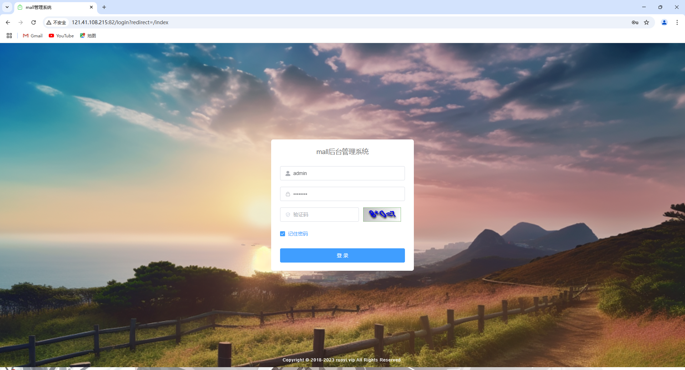
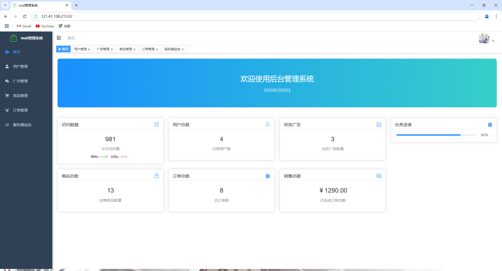
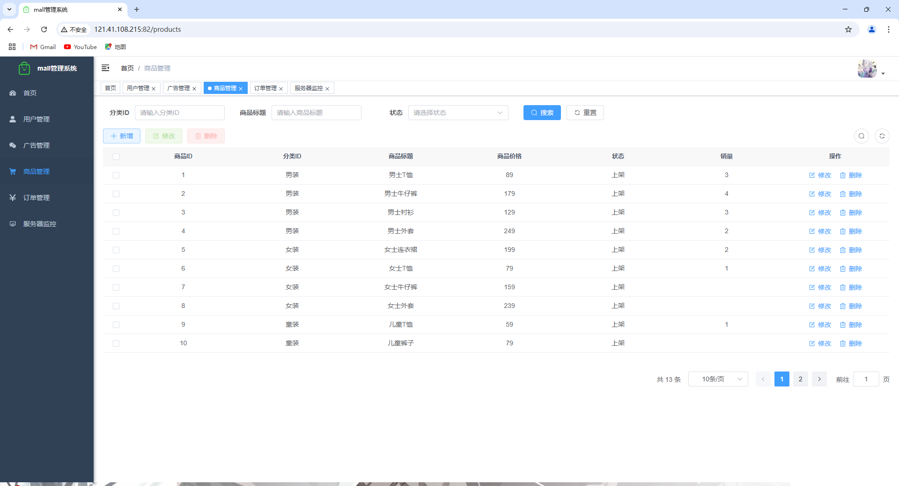
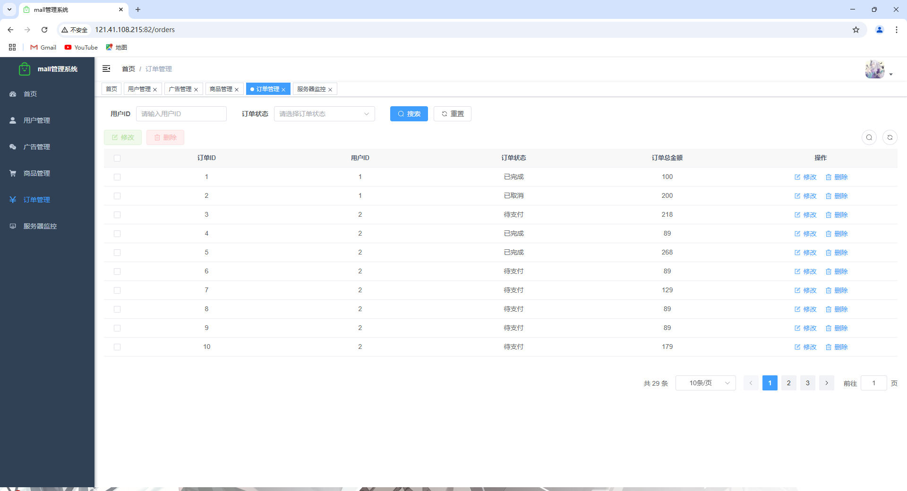
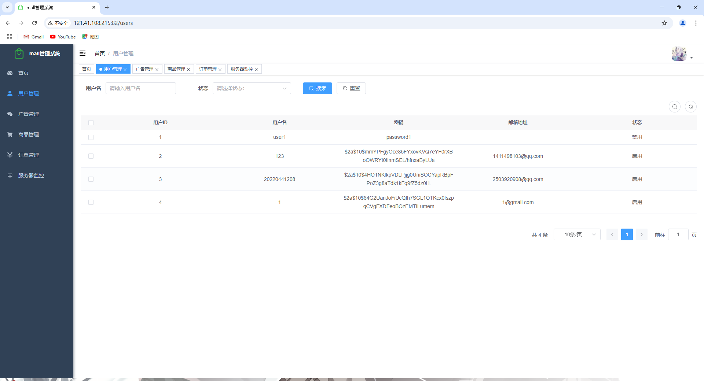
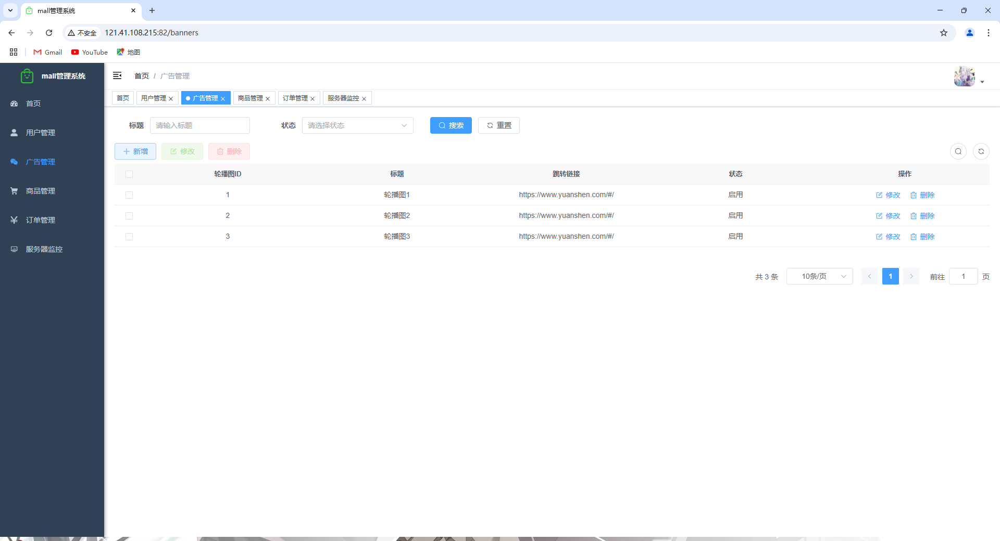
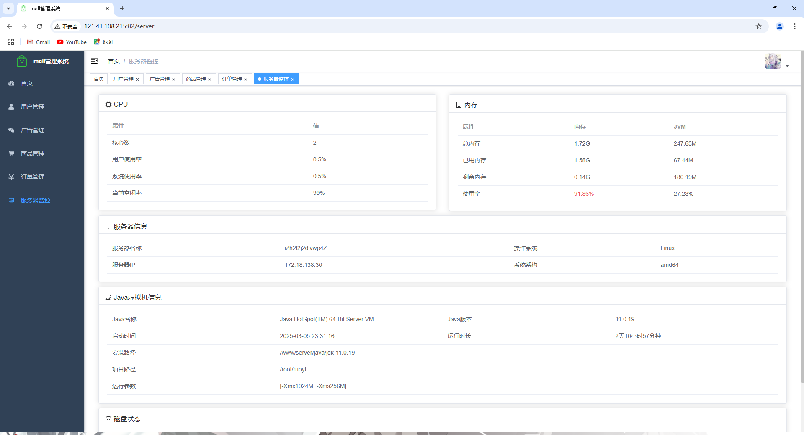

# 商城后台管理系统后端项目

## 项目介绍

本项目是基于 RuoYi 框架开发的后台管理系统后端部分，为前端提供完整的电商管理功能API接口，包括商品管理、订单管理、用户管理、广告管理等模块。系统采用微服务架构设计，性能稳定，扩展性强。

## 技术栈

- **核心框架**：Spring Boot 2.7.x
- **安全框架**：Spring Security
- **持久层框架**：MyBatis Plus
- **数据库**：MySQL 8.0
- **缓存**：Redis
- **任务调度**：Quartz
- **API文档**：Swagger/Knife4j
- **日志管理**：SLF4J + Logback
- **工具库**：Hutool、Apache Commons

## 功能模块

### 登录界面



### 首页仪表盘
- 数据统计服务：提供访问数据、用户总数、商品总数、订单总数等关键指标API
- 实时数据更新：支持定时任务自动刷新访问数据

  

### 商品管理
- 商品信息CRUD接口
- 商品分类管理接口
- 商品上架/下架状态控制
- 商品详情数据处理

  

### 订单管理
- 订单数据查询接口
- 订单状态流转控制
- 订单详情数据处理
- 销售额统计分析

  

### 用户管理
- 用户信息CRUD接口
- 用户权限控制
- 用户行为数据分析

  

### 广告管理
- 广告内容CRUD接口
- 广告位置配置
- 广告状态控制

  

### 服务器管理
- 服务器状态监控
- 性能指标采集
- 系统资源管理



## 系统架构

### 微服务模块
- **mall-admin**：后台管理核心模块
- **mall-system**：系统管理模块
- **mall-framework**：框架核心模块
- **mall-common**：通用工具模块
- **mall-quartz**：定时任务模块
- **mall-generator**：代码生成模块
- **mall-manage**：业务管理模块

### 数据流转
系统采用RESTful API设计，前后端分离架构，数据交互采用JSON格式，支持跨域请求，确保数据传输的安全性和高效性。

### 安全机制
- 基于JWT的身份认证
- 细粒度的权限控制
- 防SQL注入、XSS攻击
- 敏感数据加密存储

## 安装与使用

### 环境要求
- JDK >= 1.8
- Maven >= 3.6
- MySQL >= 8.0
- Redis >= 6.0

### 安装步骤
```bash
# 克隆项目
git clone [项目地址]

# 进入项目目录
cd mall

# 编译项目
mvn clean package

# 启动项目
java -jar mall-admin/target/mall-admin.jar
```

### 配置说明
项目的主要配置文件位于：
- `application.yml`：应用主配置
- `application-dev.yml`：开发环境配置
- `application-prod.yml`：生产环境配置

可根据实际需求修改数据库连接、Redis配置等。

## 项目预览

项目演示地址：[http://121.41.108.215:82/](http://121.41.108.215:82/)

（网址打开不了就是服务器到期了ξ( ✿＞◡❛)，希望大家尽量不要进行修改删除操作，谢谢大家的配合(´・ω・`)。若数据遭到恶意修改删除请联系管理员QQ:1411498103）

服务器管理不易，如果觉得项目对您有益，请支持多多一下我们，谢谢(✿◠‿◠)


## 许可证

本项目使用 MIT 许可证 - 详情请参阅 [LICENSE](LICENSE) 文件
